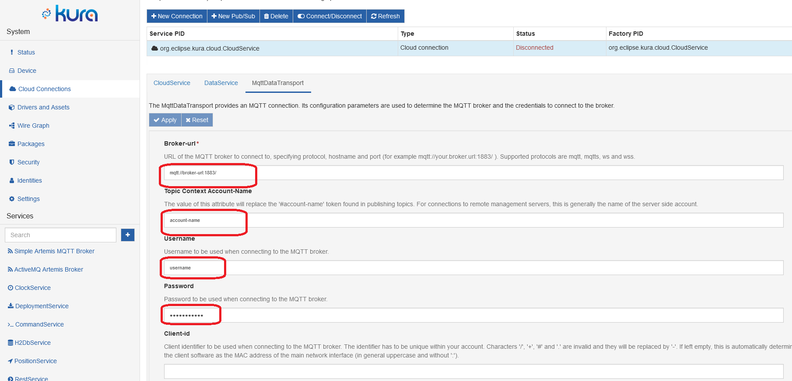
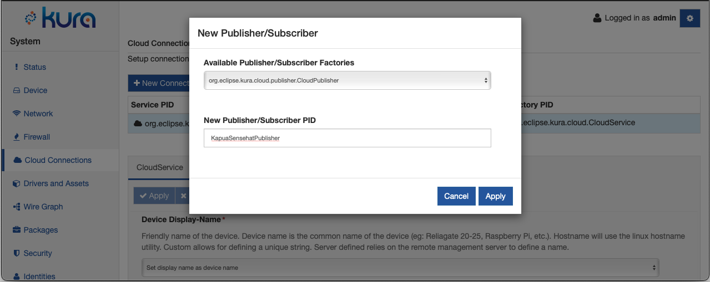
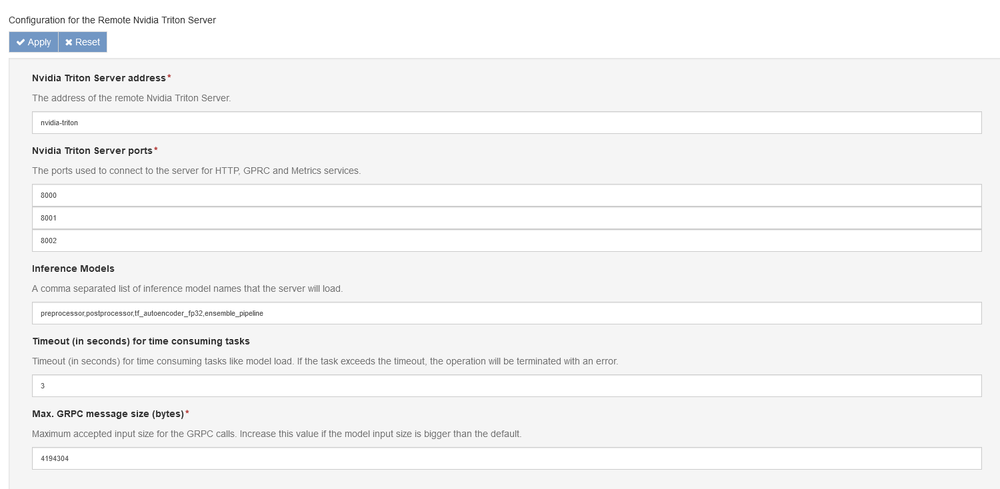

# Eclipsecon 2023 Talk tutorial: Addressing Edge AI Challenges to scale. Anomaly detection/inference made simple with Eclipse Kura & Kapua.

This tutorial contains the instructions for collect the data provided by a Raspberry PI Sense HAT simulator using [Eclipse Kura&trade;](https://www.eclipse.org/kura/) and upload them to a [Eclipse Kapua&trade;](https://www.eclipse.org/kapua/) instance. We will then download this data and train an AI-based anomaly detector using [TensorFlow](https://www.tensorflow.org/). Finally we will deploy the trained anomaly detector model leveraging [Nvidia Triton&trade; Inference Server](https://developer.nvidia.com/nvidia-triton-inference-server) and Eclipse Kura&trade; integration.


We'll subdivide this tutorial in three main sections:
1. **Data collection**: in this section we'll discuss how to retrieve training data from the field leveraging Eclipse Kura&trade; and Eclipse Kapua&trade;
2. **Model building and training**: we'll further divide this section in three subsections:
    - *Data processing*: where we'll show how to explore our training data and manipulate them to make them suitable for training (feature selection, scaling and dataset splitting). This will provide us with the "_Preprocessing_" stage of the resulting AI data-processing pipeline
    - *Model training*: where we'll discuss how we can create a simple Autoencoder in Tensorflow Keras and how to train it. This will provide us with the "_Inference_" stage of the AI pipeline
    - *Model evaluation*: where we'll cover how can we extract the high level data from the model output and ensure the model was trained correctly. This will provide us with the "_Postprocessing_" stage of the AI pipeline
3. **Model deployment**: finally we will convert the model to make it suitable for running on Eclipse Kura&trade; and Nvidia Triton&trade; and deploy it on the edge.

## Data Collection

### Overview

In this setup we'll leverage Eclipe Kura&trade; and Kapua&trade; for retrieving data from a [Dummy Sense HAT Driver](resources/org.eclipse.kura.example.driver.dummysensehat_1.0.0-SNAPSHOT.dp) and upload them to the cloud.

The Sense HAT is an add-on board for Raspberry Pi which provides an 8×8 RGB LED matrix, a five-button joystick and includes the following sensors:

- Gyroscope
- Accelerometer
- Magnetometer
- Temperature
- Barometric pressure
- Humidity

For the purpose of this Tutorial we will use a Dummy Driver developed ad-hoc providing a set of credible data for the sensors listed above.


### Accessing Eclipse Kura&trade; 

Open with your browser the URL https://localhost with the following credentials:

```
username: admin
passw: admin
```
The first time you log in you will be asked to change the default password.


### Cloud connection

After setting up an Eclipse Kura&trade; instance on the Raspberry Pi we'll need to connect it to the [Eclipse Kapua&trade;](https://www.eclipse.org/kapua/) instance created in the local area network.


Fill in, with the information provided, the fields of the default CloudService Connection under the MqttDataTransport tab, as highlighted in the following image



Next, press the Connect button and verify that Kura correctly connects to the Kapua instance. The status field in the cloud services table should be `Connected`.


### Data publisher

To publish the collected data on the Cloud we'll need to create a new [Cloud Publisher](https://eclipse.github.io/kura/docs-release-5.2/cloud-api/overview/#cloudpublisher) through the Kura&trade; web interface. Go to "Cloud Connections" and press "New Pub/Sub", in the example below we'll call our new publisher `KapuaSenseHatPublisher`.



To keep things clean we'll create a new topic called `SenseHat`. To do so we'll move to the `KapuaSenseHatPublisher` configuration and we'll update the `Application Topic` field to `A1/SenseHat`


### SenseHat Dummy driver

Kura&trade; provides a driver that allows to interact to a RaspberryPi SenseHat device using [Kura Driver, Asset and Wires frameworks](https://eclipse.github.io/kura/docs-develop/connect-field-devices/driver-and-assets/).

For this tutorial, we created a SenseHat Dummy driver that emulates the data returned by a real device.

From the Kura&trade; documentation:

> Eclipse Kura introduces a model based on the concepts of Drivers and Assets to simplify the communication with the field devices attached to a gateway.
>
> A **Driver** encapsulates the communication protocol and its configuration parameters, dealing with the low-level characteristics of the field protocol. It opens, closes and performs the communication with the end field device. It also exposes field protocol specific information that can be used by upper levels of abstraction to simplify the interaction with the end devices.
>
> An **Asset** is a logical representation of a field device, described by a list of **Channels**. The Asset uses a specific Driver instance to communicate with the underlying device and it models a generic device resource as a Channel. A register in a PLC or a GATT Characteristic in a Bluetooth device are examples of Channels. In this way, each Asset has multiple Channels for reading and writing data from/to an Industrial Device.

#### Driver configuration

We now need to configure the driver to access the emulated sensors on the Dummy SenseHat. Move to the "Driver and Assets" section of the web UI and create a new driver. We'll call it `driver-sensehat`. For the time being, we leave the default configuration


Then add a new Asset (which we'll call `asset-sensehat`) to this driver and configure it as per the screenshots below. We'll need a Channel for every sensor we want to access.


Refer to the following table for the driver parameters:

| name       | type | value.type | resource                  |
| ---------- | ---- | ---------- | ------------------------- |
| ACC_X      | READ | FLOAT      | ACCELERATION_X            |
| ACC_Y      | READ | FLOAT      | ACCELERATION_Y            |
| ACC_Z      | READ | FLOAT      | ACCELERATION_Z            |
| GYRO_X     | READ | FLOAT      | GYROSCOPE_X               |
| GYRO_Y     | READ | FLOAT      | GYROSCOPE_Y               |
| GYRO_Z     | READ | FLOAT      | GYROSCOPE_Z               |
| HUMIDITY   | READ | FLOAT      | HUMIDITY                  |
| PRESSURE   | READ | FLOAT      | PRESSURE                  |
| MAGNET_X   | READ | FLOAT      | MAGNETOMETER_X            |
| MAGNET_Y   | READ | FLOAT      | MAGNETOMETER_Y            |
| MAGNET_Z   | READ | FLOAT      | MAGNETOMETER_Z            |
| TEMP_HUM   | READ | FLOAT      | TEMPERATURE_FROM_HUMIDITY |
| TEMP_PRESS | READ | FLOAT      | TEMPERATURE_FROM_PRESSURE |

After correctly configuring it you should see the data in the "Data" page of the UI.


### Wire graph

Now that we have our Driver and Cloud Publisher ready we can put everything together with a [Kura Wire Graph](https://eclipse.github.io/kura/docs-develop/kura-wires/introduction/).

From Kura&trade; documentation:

> The Kura&trade; Wires feature aims to simplify the development of IoT Edge Computing Applications leveraging reusable configurable components that can be wired together and which, eventually, allows configurable cooperation between these components.
>
> In the dataflow programming model, the application logic is expressed as a directed graph (flow) where each node can have inputs, outputs, and independent processing units. There are nodes that only produce outputs and ones that only consume inputs, which usually represent the start and the end of the flow. The inner-graph nodes process the inputs and produce outputs for downstream nodes. The processing unit of a node executes independently and does not affect the execution of other nodes. Thus, the nodes are highly reusable and portable.

Move to the "Wire Graph" section of the UI. We'll need a graph with three components:
- A `Timer` which will dictate the sample rate at which we will collect data coming from the Sense Hat
- A `WireAsset` for the Sense Hat driver asset
- A `Publisher` for the Kapua publisher we created before.

The resulting Wire Graph will look like this:


#### Timer

Configure the timer such that it will poll the SenseHat each second, this can be done by setting the `simple.interval` to `1`.


#### WireAsset

Select the `driver-sensehat` when creating the WireAsset. No further configuration is needed for this component.


#### Publisher

Create a "Publisher" Wire component and select the `KapuaSensehatPublisher` from the target filter.


Don't forget to press "Apply" to start the Wire Graph!

### Collect the data

At this point you should see data coming from the Rasperry Pi from the Kapua&trade; console under the `SenseHat` topic.


You can download the `.csv` file directly from the console using the "_Export to CSV_" button.
**<u>However, in this tutorial we will use the csv file provided by us because collecting a good amount of data would take too long.</u>**

## Model building and training

For this phase of the tutorial, follow the instructions in the Jupyter Notebook container running on your machine.

To access to the notebook copy/paste the link printed in the console after started the docker container, e.g:

```
http://localhost:8888/lab?token=<token-id>
```

## Model deployment

We can now move our pipeline to the target device for inference on the edge.

We want to perform anomaly detection in real time, directly within the edge device, using the same data we used to collect for our training.


#### Triton component configuration

To do so we need to copy the content of the `models` folder from the Jupyter Notebook into `triton-models` folder in your current working directory preserving the directory structure.

We can now move to the Kura web UI and create a new Triton Server Remote Service component instance. The complete documentation can be found [here](https://eclipse.github.io/kura/docs-release-5.2/core-services/nvidia-triton-server-inference-engine/).

In this example we'll call it `TritonRemoteServerService`.


Then we'll need to configure it to run our models. Move to the `TritonServerService` configuration interface and set the following parameters:

- **Nvidia Triton Server address**: use nvidia-triton
- **Nvidia Triton Server ports**: set the ports 8000,8001,8002
- **Inference Models**: we'll need to load all the models of the pipeline so: `preprocessor,postprocessor,tf_autoencoder_fp32,ensemble_pipeline`

You can leave everything else as default.



Once you press the "_Apply_" button Kura will connect to the Triton docker instance triggering the models loading.

### Wire Graph

Finally we can move to the "_Wire Graph_" UI and create the AI component (in the Emitters/Receiver menu) for interfacing with the Triton instance.

We'll call it `Triton` in this example.


We just need to change two parameter in the configuration:
- **InferenceEngineService Target Filter**: we need to select the `TritonServerRemoteService` we created at the step above
- **inference.model.name**: Since we're using an ensemble pipeline we need only that as our inference model.

It is also necessary to change the behaviour of the dummy driver to generate certain anomalies. To do this, the `sense-hat` driver configuration must be changed, enabling the generation of anomalies:


The resulting wire graph is the following:


And that's it! We should now see the anomaly detection results coming to Kapua in addition to the SenseHat data.

